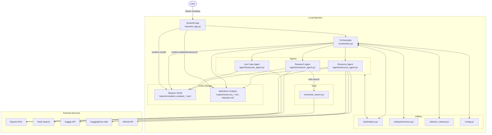
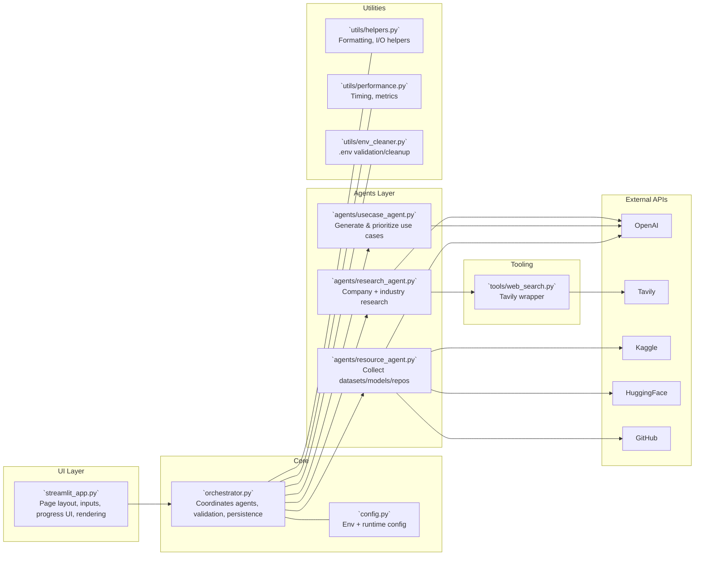
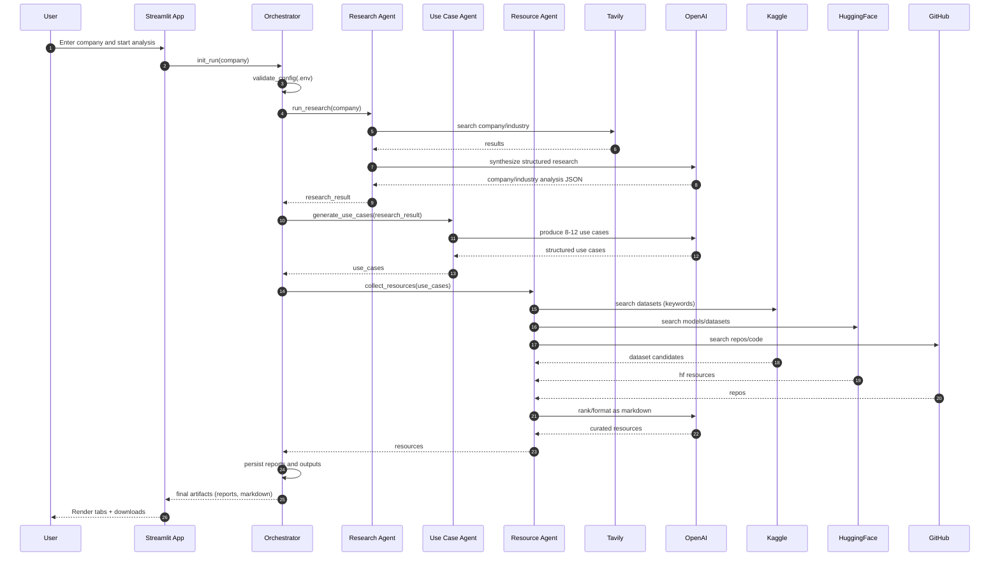
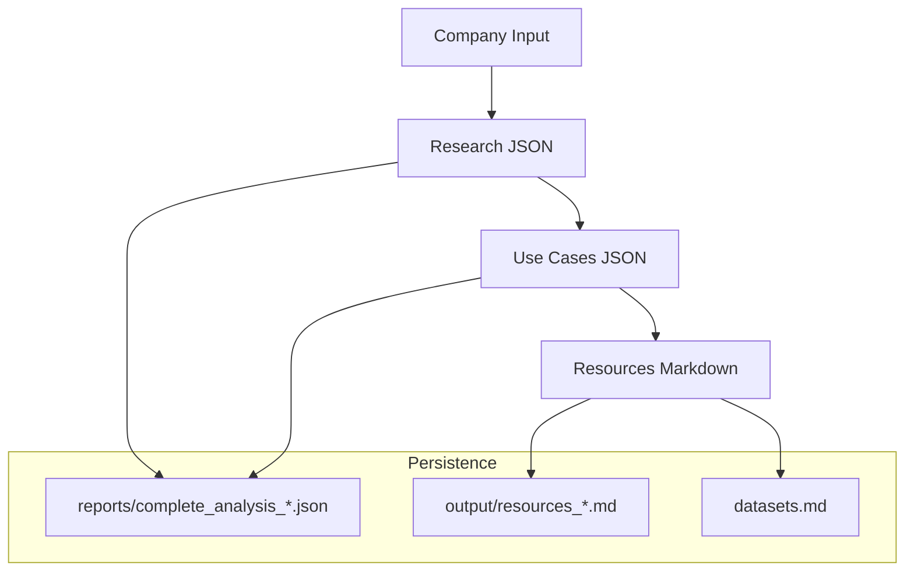
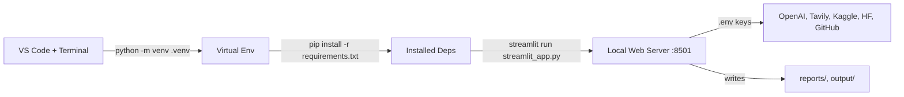

# Multi-Agent Market Research System — Architecture Diagrams

This document visualizes the complete system architecture, covering UI, orchestration, agents, utilities, external services, data flow, and execution sequences.

## Complex Workflow (Detailed Flowchart)

```mermaid
flowchart TD
    Start([User Opens Streamlit App]) --> LoadEnv[Load Environment Variables]
    LoadEnv --> ValidateEnv{Validate .env File}
    ValidateEnv -- Invalid --> ShowError[Display Configuration Error]
    ValidateEnv -- Valid --> InitUI[Initialize Streamlit UI]
    
    InitUI --> UserInput[User Enters Company Name]
    UserInput --> ValidateInput{Validate Company Input}
    ValidateInput -- Empty/Invalid --> InputError[Show Input Error]
    ValidateInput -- Valid --> StartAnalysis[Initialize Orchestrator]
    
    StartAnalysis --> InitPerf[Start Performance Tracking]
    InitPerf --> InitResearchAgent[Initialize Research Agent]
    
    %% Research Agent Flow
    InitResearchAgent --> SearchCompany[Tavily Web Search: Company Info]
    SearchCompany --> TavilyLimit{Tavily API Limit?}
    TavilyLimit -- Yes --> TavilyError[Log Tavily Error\nContinue with Limited Data]
    TavilyLimit -- No --> ProcessSearch[Process Search Results]
    
    TavilyError --> FallbackResearch[Use Fallback Research Data]
    ProcessSearch --> SearchIndustry[Tavily Web Search: Industry Info]
    SearchIndustry --> ProcessIndustry[Process Industry Results]
    
    FallbackResearch --> CallOpenAIResearch[OpenAI: Synthesize Research]
    ProcessIndustry --> CallOpenAIResearch
    
    CallOpenAIResearch --> OpenAILimit1{OpenAI API Limit?}
    OpenAILimit1 -- Yes --> OpenAIError1[Log OpenAI Error\nRetry with Fallback]
    OpenAILimit1 -- No --> StructureResearch[Structure Research JSON]
    
    OpenAIError1 --> RetryResearch{Retry Count < 3?}
    RetryResearch -- Yes --> CallOpenAIResearch
    RetryResearch -- No --> FailResearch[Research Failed\nUse Mock Data]
    
    StructureResearch --> ValidateResearchOutput{Valid Research JSON?}
    ValidateResearchOutput -- No --> FailResearch
    ValidateResearchOutput -- Yes --> SaveResearchTemp[Save Research to Memory]
    
    FailResearch --> SaveResearchTemp
    SaveResearchTemp --> InitUseCaseAgent[Initialize Use Case Agent]
    
    %% Use Case Agent Flow
    InitUseCaseAgent --> ProcessResearchData[Process Research Input]
    ProcessResearchData --> GenerateUseCases[OpenAI: Generate Use Cases]
    
    GenerateUseCases --> OpenAILimit2{OpenAI API Limit?}
    OpenAILimit2 -- Yes --> OpenAIError2[Log OpenAI Error\nRetry]
    OpenAILimit2 -- No --> ParseUseCases[Parse Use Cases JSON]
    
    OpenAIError2 --> RetryUseCases{Retry Count < 3?}
    RetryUseCases -- Yes --> GenerateUseCases
    RetryUseCases -- No --> FailUseCases[Use Cases Failed\nGenerate Fallback]
    
    ParseUseCases --> ValidateUseCases{Valid Use Cases?}
    ValidateUseCases -- No --> FailUseCases
    ValidateUseCases -- Yes --> CheckDistribution{Check Distribution Constraints}
    
    CheckDistribution -- Fails --> RewriteUseCases[Rewrite Use Cases for Balance]
    RewriteUseCases --> ValidateUseCases
    CheckDistribution -- Passes --> PrioritizeUseCases[Prioritize Use Cases]
    
    FailUseCases --> PrioritizeUseCases
    PrioritizeUseCases --> SaveUseCasesTemp[Save Use Cases to Memory]
    SaveUseCasesTemp --> InitResourceAgent[Initialize Resource Agent]
    
    %% Resource Agent Flow
    InitResourceAgent --> ExtractKeywords[Extract Keywords from Use Cases]
    ExtractKeywords --> ParallelResourceSearch{Start Parallel Resource Collection}
    
    ParallelResourceSearch --> SearchKaggle[Search Kaggle Datasets]
    ParallelResourceSearch --> SearchHuggingFace[Search HuggingFace Models/Datasets]
    ParallelResourceSearch --> SearchGitHub[Search GitHub Repositories]
    
    SearchKaggle --> KaggleLimit{Kaggle API Available?}
    KaggleLimit -- No --> SkipKaggle[Skip Kaggle Resources]
    KaggleLimit -- Yes --> ProcessKaggle[Process Kaggle Results]
    
    SearchHuggingFace --> HFLimit{HuggingFace API Available?}
    HFLimit -- No --> SkipHF[Skip HuggingFace Resources]
    HFLimit -- Yes --> ProcessHF[Process HuggingFace Results]
    
    SearchGitHub --> GitHubLimit{GitHub API Available?}
    GitHubLimit -- No --> SkipGitHub[Skip GitHub Resources]
    GitHubLimit -- Yes --> ProcessGitHub[Process GitHub Results]
    
    SkipKaggle --> MergeResources[Merge All Resources]
    ProcessKaggle --> MergeResources
    SkipHF --> MergeResources
    ProcessHF --> MergeResources
    SkipGitHub --> MergeResources
    ProcessGitHub --> MergeResources
    
    MergeResources --> DeduplicateResources[Deduplicate Resources]
    DeduplicateResources --> ScoreResources[Score Resource Relevance]
    ScoreResources --> EnforceMixRatio[Enforce Platform Mix Ratio]
    EnforceMixRatio --> GenerateMarkdown[Generate Resource Markdown]
    
    GenerateMarkdown --> CallOpenAIResource[OpenAI: Format Resources]
    CallOpenAIResource --> OpenAILimit3{OpenAI API Limit?}
    OpenAILimit3 -- Yes --> OpenAIError3[Use Raw Resource Format]
    OpenAILimit3 -- No --> FormatResources[Format Final Resources]
    
    OpenAIError3 --> SaveResourcesTemp[Save Resources to Memory]
    FormatResources --> SaveResourcesTemp
    
    %% Final Orchestration
    SaveResourcesTemp --> CombineResults[Combine All Agent Results]
    CombineResults --> GenerateReports[Generate JSON Reports]
    GenerateReports --> GenerateMarkdownFiles[Generate Markdown Files]
    GenerateMarkdownFiles --> SaveToOutput[Save to output/ and reports/]
    
    SaveToOutput --> UpdateUIProgress[Update UI Progress: 100%]
    UpdateUIProgress --> DisplayResults[Display Results in Streamlit Tabs]
    
    DisplayResults --> ShowCompanyAnalysis[Tab: Company Analysis]
    DisplayResults --> ShowUseCases[Tab: Use Cases]
    DisplayResults --> ShowResources[Tab: Resources]
    DisplayResults --> ShowExecutiveSummary[Tab: Executive Summary]
    DisplayResults --> ShowDownloads[Tab: Downloads]
    
    %% Error Handling Paths
    ShowError --> End1[End with Error]
    InputError --> UserInput
    
    %% Success Path
    ShowDownloads --> StopPerf[Stop Performance Tracking]
    StopPerf --> LogCompletion[Log Analysis Completion]
    LogCompletion --> End2[End Successfully]
    
    %% Styling
    classDef errorNode fill:#ffcccc,stroke:#ff0000,stroke-width:2px
    classDef successNode fill:#ccffcc,stroke:#00ff00,stroke-width:2px
    classDef processNode fill:#cceeff,stroke:#0066cc,stroke-width:2px
    classDef decisionNode fill:#ffffcc,stroke:#ffaa00,stroke-width:2px
    classDef agentNode fill:#e6ccff,stroke:#9900cc,stroke-width:2px
    
    class ShowError,TavilyError,OpenAIError1,OpenAIError2,OpenAIError3,FailResearch,FailUseCases,InputError errorNode
    class End2,LogCompletion,StopPerf successNode
    class InitResearchAgent,InitUseCaseAgent,InitResourceAgent agentNode
    class ValidateEnv,ValidateInput,TavilyLimit,OpenAILimit1,OpenAILimit2,OpenAILimit3,ValidateResearchOutput,ValidateUseCases,CheckDistribution,KaggleLimit,HFLimit,GitHubLimit decisionNode
```

## 1) System Context Diagram

## 2) Component Diagram (Modules and Responsibilities)

## 3) End-to-End Sequence Diagram

## 4) Data Flow and Artifacts

## 5) Deployment / Runtime View

## 6) Error Handling and Limits (Operational)

- **Configuration guardrails**: `.env` validated/sanitized via `utils/env_cleaner.py` before runs.
- **API usage limits**: External services may rate limit. System should surface errors in UI logs; operators may retry or adjust keys/plan.
- **Partial completion**: If any external source fails, downstream steps should still produce best-effort outputs from available data.
- **Observability**: `utils/performance.py` supports timing/metrics; Streamlit console shows detailed logs.

## 7) Environment & Keys

- Required: `OPENAI_API_KEY`, `TAVILY_API_KEY`
- Optional: `KAGGLE_USERNAME`, `KAGGLE_KEY`, `GITHUB_TOKEN`, `HUGGINGFACE_TOKEN`

---

Use these diagrams in design reviews and onboarding. They map directly to modules found under `agents/`, `utils/`, `tools/`, and the top-level `streamlit_app.py` and `orchestrator.py`.

